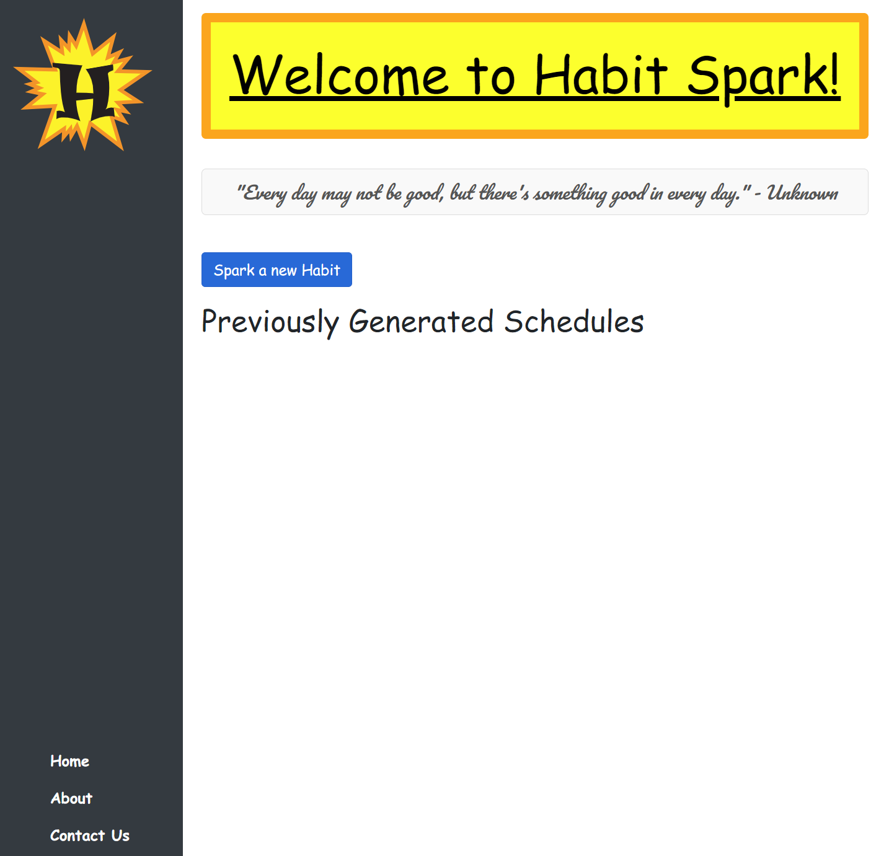
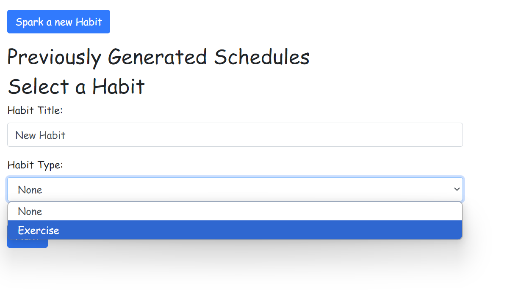
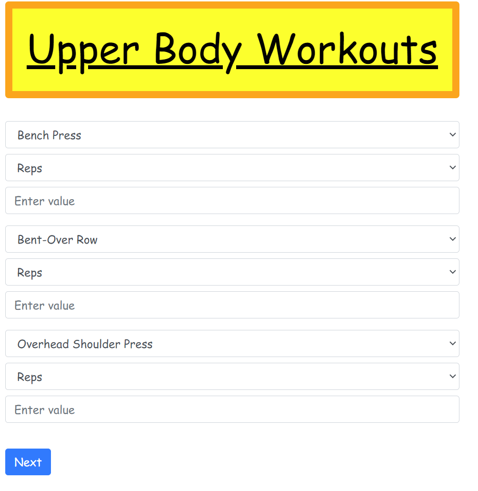
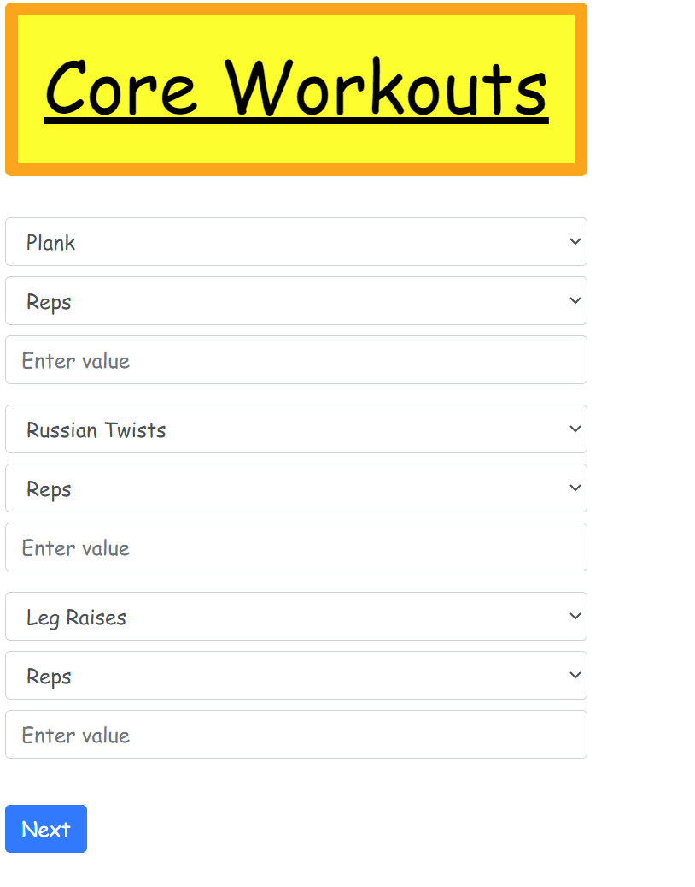
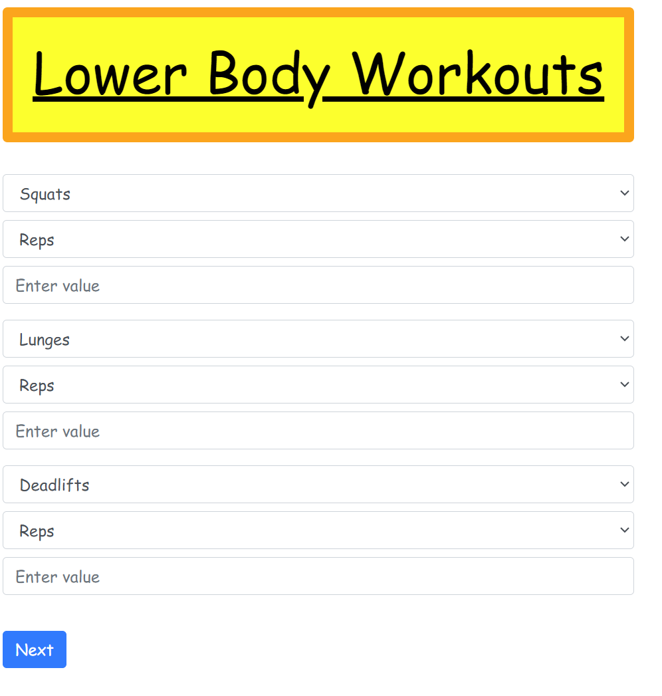
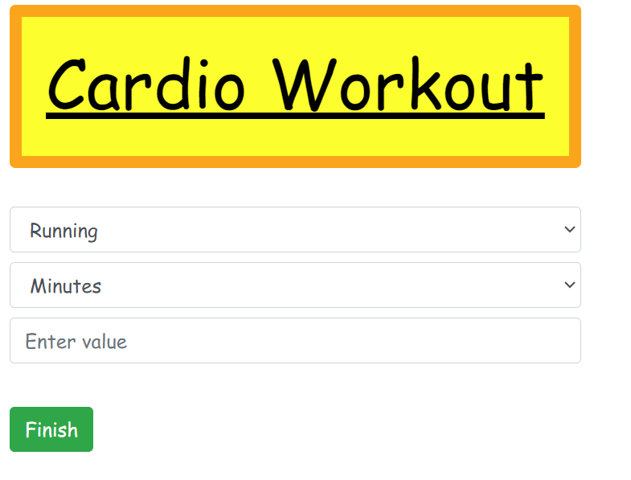

# Habit Spark

## Overview

**Habit Spark** is a web application designed to help users build and maintain new habits by generating a personalized 3-week activity schedule. Users can create new habit plans, choose specific workouts, and track their progress over time. The app is built with a user-friendly interface and leverages modern web technologies to ensure a smooth and engaging experience.

## Features

- **Custom Habit Creation:** Users can create new habits and set personalized workout schedules.
- **Exercise Categories:** Supports upper body, core, lower body, and cardio workouts with predefined exercises.
- **3-Week Schedule Generation:** Automatically generates a 3-week schedule based on user input.
- **Downloadable Schedules:** Users can download their generated schedules for offline access.
- **Schedule Management:** Users can view, delete, and re-download their previously created schedules.
- **Responsive Design:** The app is mobile-friendly, ensuring a seamless experience across different devices.
- **A Motivational Quote:** A random motivational quote from zenquote.io is present on the home page to help spark the creative flow.

## Technologies Used

- **Frontend:** HTML, CSS, JavaScript (ES6+)
- **Styling Framework:** Bootstrap 4.5
- **Data Storage:** Local Storage (for storing user schedules)
- **Version Control:** Git

## Getting Started

### Prerequisites

To run the app locally, you will need:

- A web browser (Chrome, Firefox, Edge, etc.)
- Basic knowledge of Git and version control

### Installation

1. **Clone the repository:**
   ```bash
   git clone https://github.com/Redwolf917/Habit-Spark.git
   ```

2. **Navigate to the project directory:**
   ```bash
   cd habit-spark
   ```

3. **Open `index.html` in your web browser to view the app:**
   ```bash
   open index.html
   ```

4. **Alternatively, use Deployed Link:**
   https://redwolf917.github.io/Habit-Spark/

## Usage

1. **Start a New Habit:**
   - Click on "Spark a new Habit" on the homepage.
   - Enter a habit title and choose "Exercise" as the habit type.
   
   


2. **Select Workouts:**
   - Choose exercises for upper body, core, lower body, and cardio days.
   - Enter the number of reps or duration for each workout.
   
   
   
   

3. **Generate Schedule:**
   - After entering all workouts, click "Finish" to generate your 3-week schedule.
   - Your schedule will be saved locally and displayed on the homepage.
   

4. **Manage Schedules:**
   - View your previously generated schedules on the homepage.
   - Use the download button to save the schedule to your device or delete schedules you no longer need.

## Future Enhancements

- **More options for habits:** I would like to add in different kinds of habits that a user can select to start.
- **Increasing difficulty of exercises:** Each week the tasks the user chose will increase in difficulty to help promote growth.
- **Integration with External APIs:** Support for additional workout categories and exercises from third-party APIs.
- **User Authentication:** Allow users to create accounts and save their progress across sessions and devices.
- **Progress Tracking:** Implement a dashboard to track users' progress over time.

## Contributing

Contributions are welcome! Please fork this repository, make your changes, and submit a pull request. Make sure to adhere to the project's code of conduct.

## Contact

For any inquiries or support, please contact Mr. Alexander Davis at [xander0429@gmail.com]
